# 博客系统前端（前台 + 后台）

配套后端：`https://github.com/crom-lmc/Blob-Backend`（Spring Boot 3 + MyBatis-Plus 3.5.7 + MySQL 5.7 + Redis，端口 `8080`）。
前端只做展示与交互，**所有样式由后台下发的主题配置驱动**。

## 目录结构

```
blog-frontend
├─ packages
│  ├─ shared          # 共享内核：主题类型 / token→CSS 变量 / 预设 / 内置 Mock API
│  │  └─ src
│  │     ├─ theme     # color.ts(派生) css.ts(token→var) default.ts presets.ts
│  │     └─ mock      # Vite 中间件实现的 /api/** Mock（与后端控制器同构）
│  ├─ web             # 前台读者端（Vite 5173）：Vue3 + TS + Pinia + 零 UI 框架
│  └─ admin           # 后台管理端（Vite 5174）：Vue3 + TS + Element Plus + ECharts
```

## 快速开始

```bash
npm install                 # 根目录 workspaces 安装

npm run dev:web             # 前台 http://localhost:5173
npm run dev:admin           # 后台 http://localhost:5174
```

默认开启内置 Mock（`VITE_USE_MOCK` 不等于 `false`），**无需后端即可完整体验**。
接后端时复制 `.env.example` 为 `.env`（或直接设置环境变量）：

```bash
# packages/web/.env
VITE_USE_MOCK=false
VITE_API_TARGET=http://localhost:8080

# packages/admin/.env
VITE_USE_MOCK=false
VITE_API_TARGET=http://localhost:8080
VITE_WEB_ORIGIN=http://localhost:5173   # 主题编辑器 iframe 预览地址
```

关闭 Mock 后，Vite 会把 `/api` 代理到 `VITE_API_TARGET`（后端已开启 CORS `allowedOriginPatterns("*")`）。

构建与类型检查：

```bash
npm run typecheck
npm run build
```

## 与后端对齐的接口约定

| 能力 | 接口 |
| --- | --- |
| 生效主题 | `GET /api/public/theme/active` → `{ version, tokens, css, layout, darkEnabled, defaultMode }` |
| 首屏聚合 | `GET /api/public/bootstrap` → `{ theme, settings }` |
| 站点设置 | `GET /api/public/settings` → `{ settings(KV), friendLinks, socialLinks, commentReviewOn, pageSize }` |
| 文章 | `GET /api/public/articles`、`/api/public/articles/{idOrSlug}`、`POST /{idOrSlug}/like`、`GET /api/public/pages/{slug}` |
| 分类 / 标签 / 归档 / 搜索 | `/api/public/categories`、`/tags`、`/archives`（按 `yyyy-MM` 聚合）、`/search?q=` |
| 评论 | `GET /api/public/articles/{idOrSlug}/comments`（分页 + `replies`）、`POST /api/public/comments`（`articleIdOrSlug`） |
| 后台鉴权 | `GET /api/admin/auth/captcha`、`POST /api/admin/auth/login`（`captchaKey/captchaCode/rememberMe`）、`GET /profile` |
| 后台文章 | CRUD + `POST /{id}/publish?publish=`、`POST /{id}/top?top=`、`POST /batch/delete`、导入导出 Markdown |
| 后台评论 | `PUT /{id}/approve`、`PUT /{id}/reject`、`POST /batch/approve`、`POST /batch/delete`、`POST /reply` |
| 后台媒体 | `GET /api/admin/media`、`/folders`、`POST /upload`（multipart `file`）、分片上传、批量删除 |
| 后台主题 | `GET /admin/themes`、`/admin/themes/{id}`、`PUT /{id}/config`、`POST /{id}/publish`、`POST /{id}/preview`、`/presets`、`/default`、`/import`、`/{id}/export` |
| 仪表盘 / 用户 / 设置 / 日志 | `/admin/dashboard/stats`、`/admin/users`(分页)、`/admin/settings`(KV)、`/admin/logs` |

统一响应体 `{ code, message, data }`，分页字段为 `records`（前端拦截器统一归一化为 `list`）。
管理端令牌头：`Authorization: Bearer <jwt>`（登录返回 `token` + `tokenType`）。

## 动态主题机制

1. `packages/shared/src/theme/css.ts` 是前后端**唯一约定**：把 `ThemeConfig` 映射为 CSS 变量
   （颜色 / 字体 / 字号阶 / 圆角 / 间距刻度 / 容器宽度），并生成 `:root` 与 `[data-theme="dark"]` 两段。
2. 前台 `index.html` 内联脚本先读 `localStorage.blog.theme.cache` 里的 CSS 文本并注入 `<style id="theme-vars">`，
   同时设置 `<html data-theme>`，**首屏零闪烁**；随后 `/api/public/theme/active` 按 `version` 判断是否刷新缓存。
3. 前台所有组件样式只允许使用 CSS 变量，主题默认值是唯一允许出现硬编码色值的地方
   （`shared/src/theme/default.ts` 与 `web/src/styles/base.css` 的兜底变量）。
4. 后台「主题编辑器」三栏：左侧配置面板（预设 / 颜色 / 字体 / 间距 / 布局 / 首页区块拖拽 / 深色 / 自定义 CSS），
   中间 iframe 加载真实前台 `/preview?token=...`，右侧操作区（撤销重做 20 步 / 保存草稿 / 发布上线 / 导入导出）。
   编辑过程中通过 `postMessage` 实时下发配置，输入即生效，无需刷新 iframe。

## 界面预览

### 前台（读者端）

| 首页 | 文章列表 |
| :---: | :---: |
| 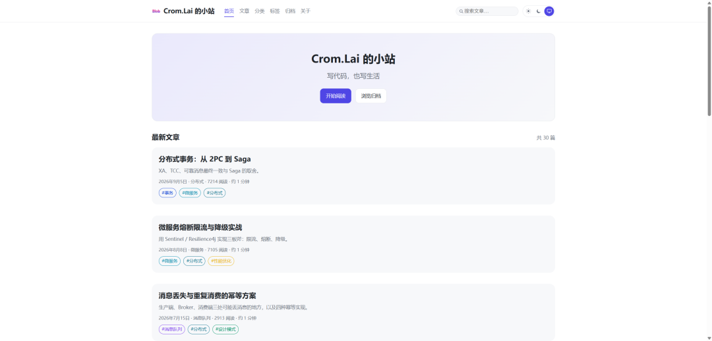 | 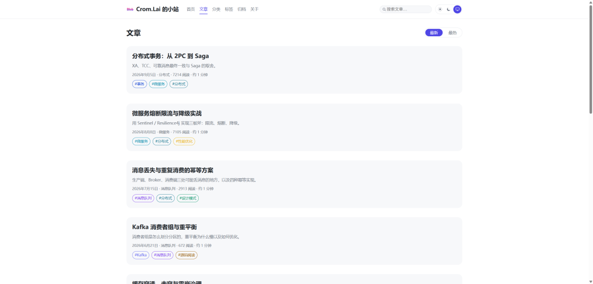 |

| 分类 | 标签 |
| :---: | :---: |
| 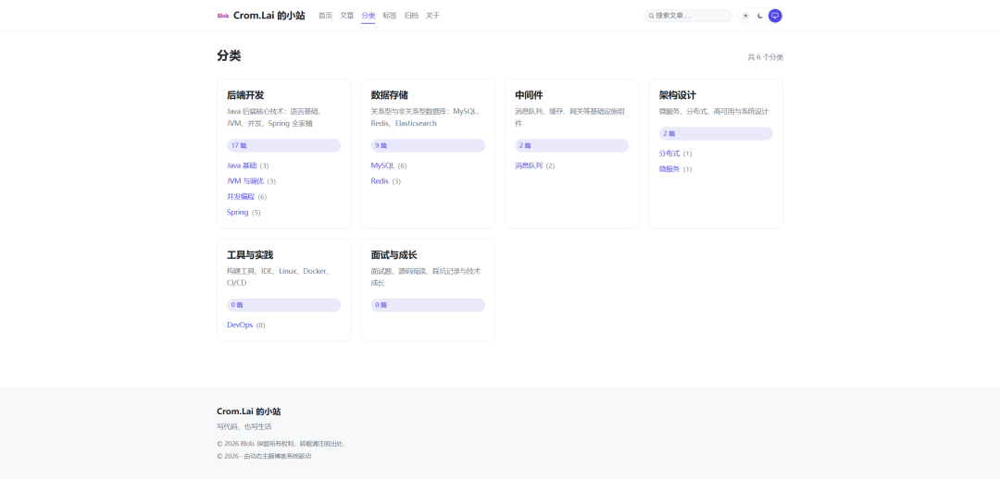 | 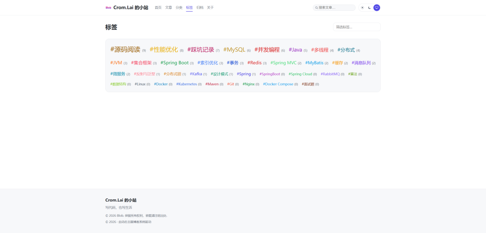 |

| 归档 | 关于 |
| :---: | :---: |
| 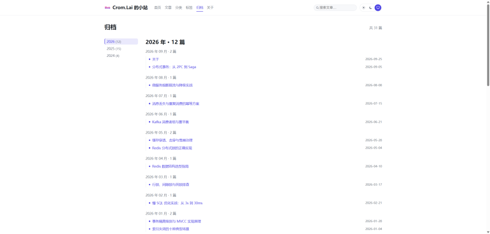 | 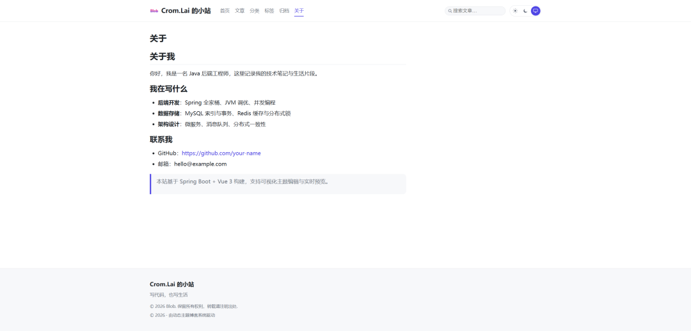 |

### 后台（管理端）

| 仪表盘 | 文章管理 |
| :---: | :---: |
| 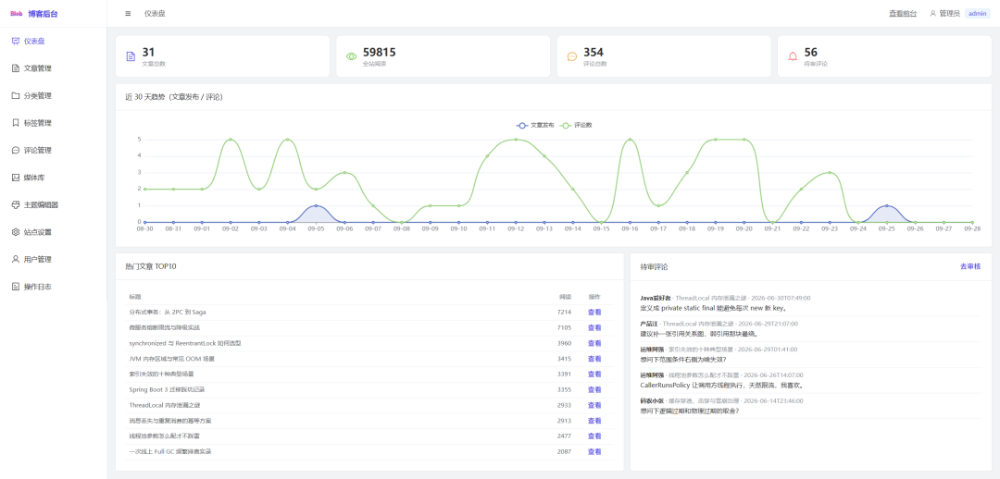 | 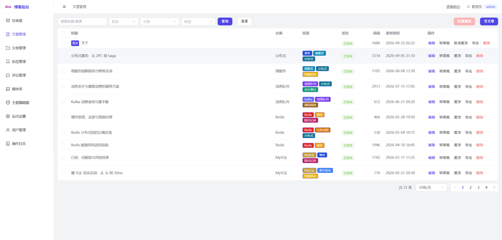 |

| 分类管理 | 标签管理 |
| :---: | :---: |
| 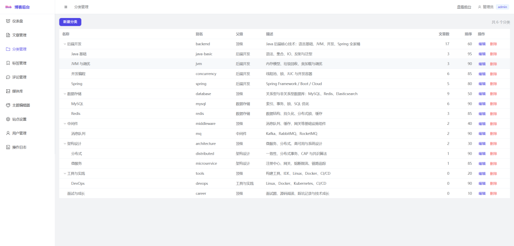 | 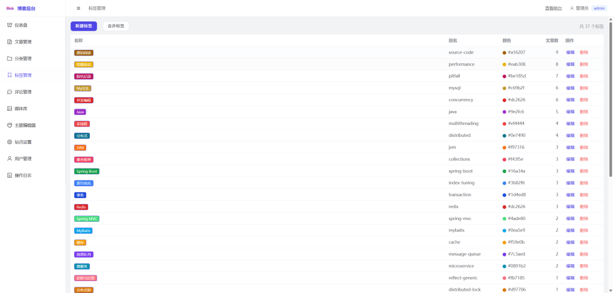 |

| 评论管理 | 媒体库 |
| :---: | :---: |
| 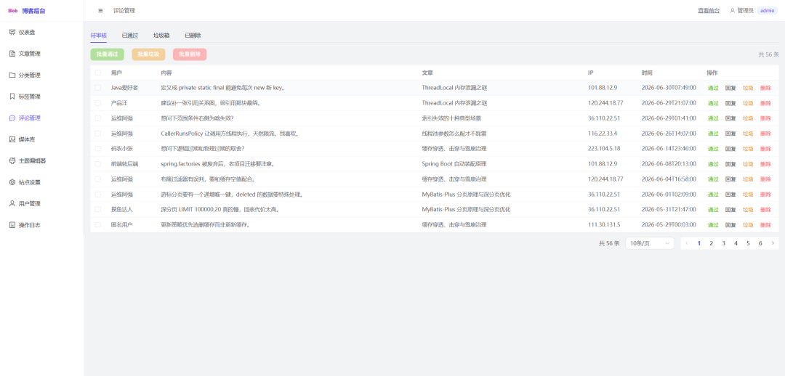 | 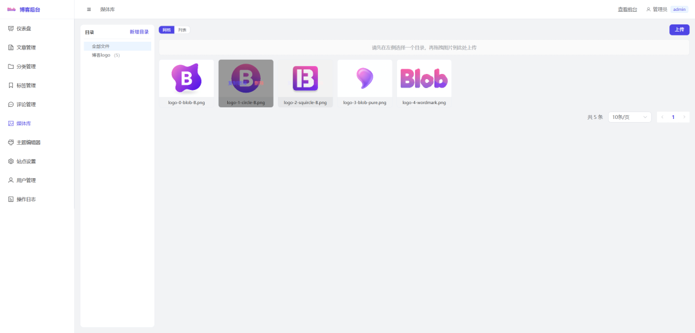 |

| 主题编辑器 | 站点设置 |
| :---: | :---: |
| 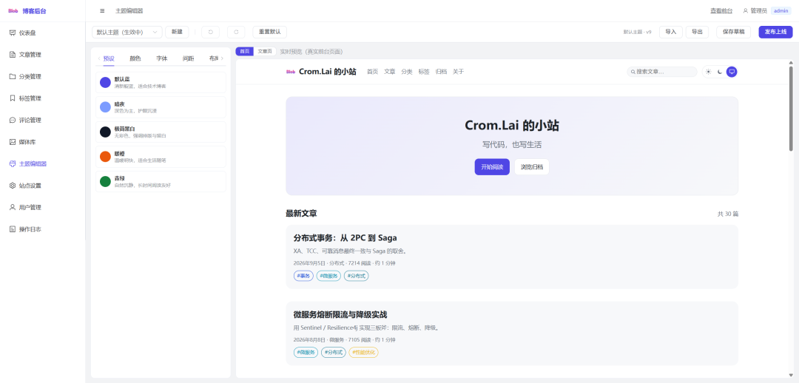 | 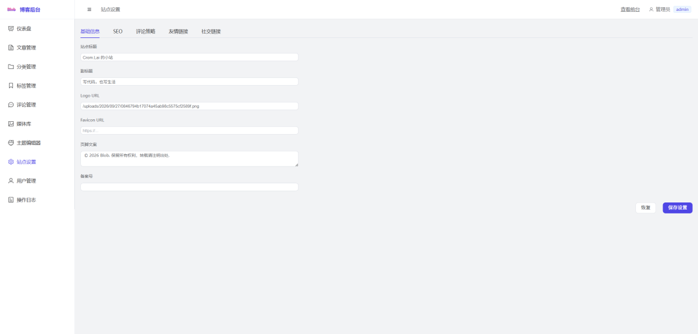 |

| 用户管理 | 操作日志 |
| :---: | :---: |
| 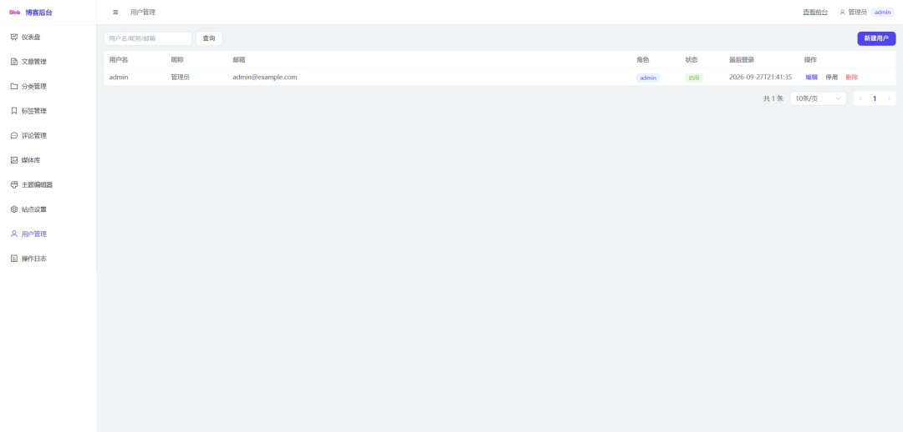 | 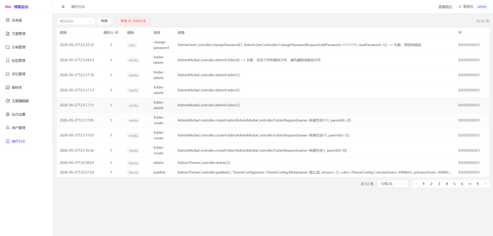 |

## 已实现功能

**前台**：首页（Hero/精选/最新/标签云/订阅，区块可拖拽排序）、文章列表/详情（Markdown 代码高亮、公式、代码复制、图片灯箱、TOC 滚动高亮、上下篇、相关阅读、点赞、评论嵌套与审核提示）、分类/标签/归档时间轴/搜索（关键词防抖 + 高亮）、自定义页面、404、深浅色切换（浅色/深色/跟随系统）、阅读进度、返回顶部、响应式三档断点、SEO（title/description/og/JSON-LD）。

**后台**：登录（图形验证码、失败提示、记住我）、仪表盘（自适应布局：正常高度无滚动条、窗口过矮时自然滚动；ECharts 趋势 + 热门文章 + 待审评论）、文章管理（筛选/发布/置顶/批量删除/导入导出）、Markdown 编辑器（md-editor-v3、30 秒自动保存草稿、字数与阅读时长）、分类/标签（标签合并）、评论审核（通过/垃圾/回复/批量）、媒体库（网格/列表、目录树、拖拽上传、**上传前必须选择具体目录**、复制 URL、点击预览大图）、站点设置（基础/SEO/评论策略/友链/社交）、用户与角色、操作日志（清理）、可视化主题编辑器。

**后台布局**：侧边栏顶部展示站点 logo（取自 `/api/public/settings` 的 `site_logo`，目录树缩回时只显示 logo，无 logo 时回退为字母块）；用户下拉新增「修改密码」——要求 8-32 位、数字/大写/小写/特殊字符至少含三种，并过滤空白、引号、反斜杠、`< > & | $ ;` 等危险字符。

## 演示账号

后端 `DataInitializer` 初始化数据；Mock 环境可用 `admin / 123456`、`author / 123456`（author 无用户/设置/日志/主题权限）。
